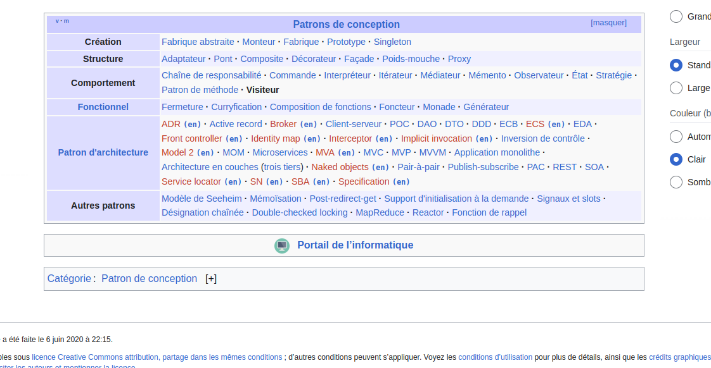
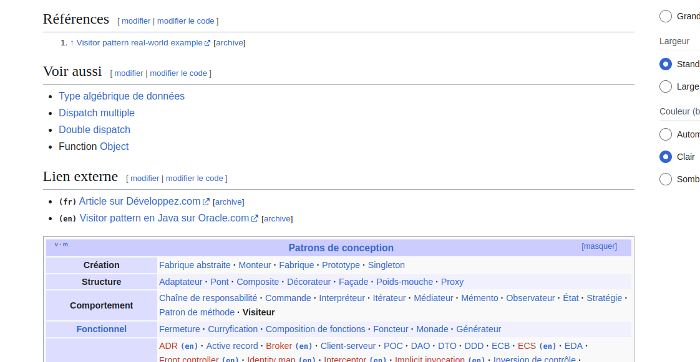

## Step 1 : Le DP composite

Le composite est souvent utilisé sur une hierarchie d'objets et qu'on souhaite manipuler tout ça avec une seule interface sans se soucier qui est quoi.

### Le DP Visitor

Les spectateurs peuvent visiter les shows, regarder, critiquer, filer sans changer un show en lui meme.

Ce DP peut etre utiliser quand on a beaucoup d'objets différents et qu'on veux faire plusieurs traitements différents dessus sans changer leur code et quand ajouter des comportements est plus fréquent que ajouter des types d’objets.

https://fr.wikipedia.org/wiki/Visiteur_(patron_de_conception)S

